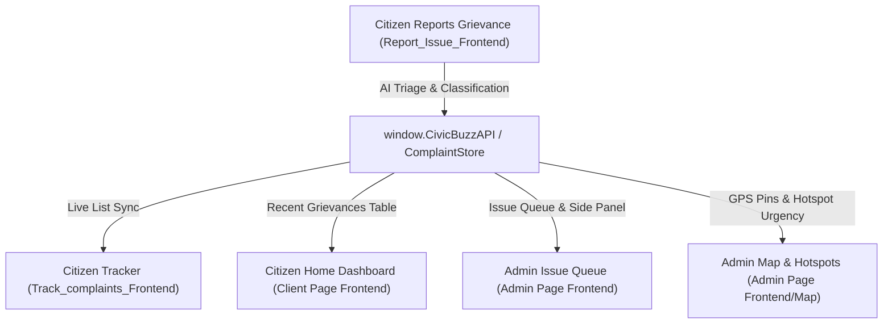

# Walkthrough: AI Triage Assistant & Admin Synchronization

Upgraded the **AI Triage Assistant** on the **Main Multi-Page HTML/JS Client Portal** ([Report_Issue_Frontend](file:///c:/Users/ASUS/Project_CivicBuzz/Netflix_Clone/Frontend/Login_Frontend/Client%20Page%20Frontend/Report_Issue_Frontend/)) with complete project features and full cross-portal integration with **Citizen Tracking** and **Admin Issue Queue & Maps**.

---

## 1. Features Implemented in the AI Triage Assistant

### A. Multilingual Intelligence & Canonical Summary
* **Real-time Language Detector**: Auto-detects input language (`🌐 हिन्दी (Hindi)`, `English`, `ଓଡ଼ିଆ`, `বাংলা`, etc.) as the user types or speaks.
* **Standardized Municipal Summary**: Generates a canonical 1–2 sentence English summary formatted for cross-departmental dispatch.
* **Multilingual Keyword Tagging**: Extracts civic tags (e.g. `#pothole`, `#traffic-hazard`).

### B. Proximity Radar & Smart Duplicate Detection
* **Real-time Cluster Scanner**: Scans open complaints in the vicinity (e.g. within 300–500m).
* **Duplicate Alert Banner**: Displays matching nearby complaints (e.g., *Similar Grievance #CB-0142 reported 45m away · 89% Match*).
* **Interactive "Upvote & Merge" Action**: Enables the citizen to upvote and merge their report into the existing ticket (boosting its municipal urgency score by +1) rather than creating clutter, with a "Keep as Distinct Issue" alternative.

### C. Multi-Modal Evidence Grounding & Authenticity Audit
* **Visual Defect Detection**: Shows detected defect tags (e.g., `Road Cavity (~1.5m)`, `Asphalt Degradation`, `Two-Wheeler Hazard`).
* **Tamper & Authenticity Score**: Visual meter showing `96% Real Civic Defect` verified.
* **Multilingual Voice Note Processing**: Web Speech API / simulated audio transcription that automatically appends voice transcripts into the grievance description.

### D. Department Jurisdiction, Urgency Score & Municipal SLA
* **Responsible Ward Unit**: Displays exact unit (e.g. `Roads & Potholes Dept. · Ward 12 Infrastructure Cell`).
* **Dynamic Urgency Calculation**: 0–100 score computed from severity, traffic, and hazard risk.
* **Guaranteed Municipal SLA**: Guaranteed turnaround timeframe (e.g., `48-Hour Resolution Window` or `24-Hour Urgent Safety SLA`).

### E. Participatory Budgeting (PB) Hotspot Bridge
* **Chronic Defect Pattern Detector**: Detects repeated issues in the corridor and flags them:
  * *"4th road defect reported in this 300m corridor this quarter. Flagged as a candidate for Community Participatory Budgeting (Road Resurfacing Proposal)."*
* **Direct PB Proposal Link**: Quick link to [Ward 12 Tenders & Public Works](file:///c:/Users/ASUS/Project_CivicBuzz/Netflix_Clone/Frontend/Login_Frontend/Client%20Page%20Frontend/Tenders/index.html).

### F. Citizen Identity Protection Shield
* **Privacy Sanitization**: Displays active protection status verifying that phone numbers and personal identity are encrypted and sanitized on the public ledger.

---

## 2. End-to-End Synchronization Matrix

---

## 3. Files Modified

1. [Report_Issue_Frontend/index.html](file:///c:/Users/ASUS/Project_CivicBuzz/Netflix_Clone/Frontend/Login_Frontend/Client%20Page%20Frontend/Report_Issue_Frontend/index.html): Upgraded HTML with 1-click sample chips, multi-modal evidence boxes, and 6 full AI Triage cards.
2. [Report_Issue_Frontend/css/style.css](file:///c:/Users/ASUS/Project_CivicBuzz/Netflix_Clone/Frontend/Login_Frontend/Client%20Page%20Frontend/Report_Issue_Frontend/css/style.css): Glassmorphic styling, pulse animations, urgency meters, and responsive dark-mode compatibility.
3. [Report_Issue_Frontend/js/script.js](file:///c:/Users/ASUS/Project_CivicBuzz/Netflix_Clone/Frontend/Login_Frontend/Client%20Page%20Frontend/Report_Issue_Frontend/js/script.js): Real-time typing debounce, heuristic & sample AI triage, duplicate scanner, speech transcription, upvote & merge, and submission handler.
4. [api-config.js](file:///c:/Users/ASUS/Project_CivicBuzz/Netflix_Clone/Frontend/Login_Frontend/api-config.js): Added AI triage metadata fields (`ai_summary`, `urgency_score`, `sla_hours`, `is_pb_candidate`, `upvotes`), added `upvote()` method, and updated API exports.
5. [Track_complaints_Frontend/js/script.js](file:///c:/Users/ASUS/Project_CivicBuzz/Netflix_Clone/Frontend/Login_Frontend/Client%20Page%20Frontend/Track_complaints_Frontend/js/script.js): Render cards with AI summary, urgency score, PB candidate badge, upvotes button, and dual verification.
6. [Client Page Frontend/script.js](file:///c:/Users/ASUS/Project_CivicBuzz/Netflix_Clone/Frontend/Login_Frontend/Client%20Page%20Frontend/script.js): Dynamically synchronizes complaint counts and table on the client homepage.
7. [Admin Page Frontend/index.html](file:///c:/Users/ASUS/Project_CivicBuzz/Netflix_Clone/Frontend/Login_Frontend/Admin%20Page%20Frontend/index.html) & [Admin Page Frontend/script.js](file:///c:/Users/ASUS/Project_CivicBuzz/Netflix_Clone/Frontend/Login_Frontend/Admin%20Page%20Frontend/script.js): Added Gemini AI Triage Audit card to the admin issue details side panel.

---

## 4. How to Test

1. **Open the Report Issue Page**:
   - Navigate to [Report_Issue_Frontend/index.html](file:///c:/Users/ASUS/Project_CivicBuzz/Netflix_Clone/Frontend/Login_Frontend/Client%20Page%20Frontend/Report_Issue_Frontend/index.html).
   - Click on any quick-fill sample chip (e.g. `🛣️ Deep Pothole (English)` or `🛣️ सड़क पर गड्ढा (Hindi)`).
   - Observe live updates across the AI Triage Assistant panel: language tag, canonical summary, proximity duplicate alert, visual defect chips, urgency score meter (`88/100`), municipal SLA (`48h`), and Participatory Budgeting hotspot flag.
2. **Test Duplicate Upvote & Merge**:
   - Click the **"Upvote & Merge (+1 Boost Urgency)"** button on the duplicate card. Notice how it upvotes the existing ticket without adding clutter.
3. **Submit a New Grievance**:
   - Click **"Run AI Triage & Submit Grievance"**.
   - See the Success Modal pop up with the complaint ID and triage overview.
4. **Inspect in Citizen Tracker**:
   - Open [Track_complaints_Frontend/index.html](file:///c:/Users/ASUS/Project_CivicBuzz/Netflix_Clone/Frontend/Login_Frontend/Client%20Page%20Frontend/Track_complaints_Frontend/index.html).
   - Verify the new grievance is listed with its AI Triage Summary, Urgency score, and tracking timeline.
5. **Inspect in Admin Dashboard**:
   - Open [Admin Page Frontend/index.html](file:///c:/Users/ASUS/Project_CivicBuzz/Netflix_Clone/Frontend/Login_Frontend/Admin%20Page%20Frontend/index.html) and click **"Track & Triage Issues"** or click 👁 on any issue.
   - The side panel will display the **Gemini AI Triage Audit** box with the canonical summary, urgency score, SLA countdown, and PB hotspot status.
